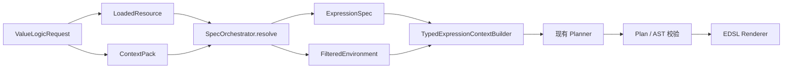

# SpecOrchestratorRecursiveResolution_20260725

## 核心功能（WHAT）

本设计将当前 Value Logic 生成链路中的“一次性 Spec 生成、资源目标生成、资源过滤和独立 NamingSQL 选择”替换为 `SpecOrchestrator` 驱动的递归求解流程。

`SpecOrchestrator` 根据当前 `node_info` 和用户 `query` 创建根目标，为每个 Goal 一次性生成可跨资源类型复用的关键词，再按照代码固定的资源优先级逐层搜索。LLM 判断合法候选是否能够覆盖当前 Goal；代码负责状态机、搜索触发、候选真实性校验、类型校验、依赖展开、循环检测和最终提交。

递归求解完成后，Orchestrator 从唯一的已提交取值链生成：

1. 描述最终取值步骤、参数绑定、依赖顺序、空值保护和回退策略的自然语言 `ExpressionSpec`；
2. 只包含最终取值链所需 Context、Local、BO、NamingSQL 和 Function 的 `FilteredEnvironment`。

下游继续使用现有 Typed Expression Context、Planner、Plan Validator、AST 和 EDSL Renderer，不感知 Orchestrator 内部 Goal Graph。

### 需求背景（WHY）

当前表达式生成链路在 `ValueLogicGenerator` 中依次执行：

```text
ResourceFilterTargetGenerator
  -> filter_resources / build_filtered_environment
  -> NamingSqlSelector
  -> TypedExpressionContextBuilder
  -> Planner
```

该流程适合一次性资源筛选，但不能稳定解决以下问题：

- 最终字段所在 BO 需要通过另一个 BO 的主键间接定位；
- NamingSQL 或 Function 的参数本身需要继续搜索；
- 多级依赖只有在上游参数闭合后才能形成可执行链路；
- 独立的 Spec、资源筛选和 NamingSQL 选择可能得到彼此不一致的结论；
- LLM 可能在缺少真实资源、缺少参数或类型不匹配时过早认定资源可用；
- Planner 在资源链路尚未闭合时承担了不应属于表达式编排阶段的资源决策。

本设计将资源搜索和取值链决策前移到统一 Orchestrator 中。Planner 只负责编排已经确认的资源，不再重新选择 BO、NamingSQL、Context 或 Function。

### 需求目标（GOAL）

1. 根据 `node_info` 和 `query` 生成一个可校验的 Root Goal。
2. 由代码控制资源搜索顺序、资源类型和搜索工具触发。
3. 由 LLM 为每个 Goal 一次性生成搜索关键词、别名及语义提示，并在所有资源层复用。
4. 由 LLM 判断当前合法候选是否在业务语义上覆盖 Goal，以及是否应继续向下一优先级搜索。
5. 对 LLM 的 Goal、关键词、候选引用和覆盖结论执行代码级强校验。
6. 对 NamingSQL、Function、BO 主键等未绑定输入创建 Dependency Goal，并递归求解。
7. 只允许来自本次请求 `LoadedResource` 或可见运行上下文的真实资源进入最终结果。
8. 从闭合后的取值链同时生成自然语言 Spec 和筛选资源环境，保证两者一致。
9. 尽量保持现有 `LoadedResource`、Registry、`ExpressionSpec`、`FilteredEnvironment`、Planner 和 AST 数据结构不变。
10. 复用现有 Context、BO、NamingSQL、Function 搜索、混合召回、LLM 重排和 Canonical ID 校验能力。

### 范围边界

#### 纳入范围

- 普通表达式节点的递归 Spec 求解；
- Root Goal 和 Dependency Goal 的生命周期管理；
- Context、Local、Iter、中间变量、BO 字段、NamingSQL、Function 搜索；
- 基于 `PropertyTerm.data_type == "key"` 的 BO 主键识别；
- 基于同名字段、基础类型和基数兼容的跨 BO 键值生产者搜索；
- NamingSQL 和 Function 参数依赖展开；
- 固定资源优先级和搜索预算；
- LLM Goal 生成、关键词生成和覆盖判断；
- 代码与 LLM 双重保护；
- 自然语言 Spec 编译；
- 最终 `FilteredEnvironment` 裁剪；
- 与现有 ContextPack、TypedContext、Planner 和校验链路集成；
- 失败、降级、循环、深度和数量预算的可观察性。

#### 不纳入范围

- 改变 `ValueLogicResult` 的公开响应；
- 重写 ResourceLoader 或更换 Registry 数据来源；
- 将 ContextPack 改造成 BO、NamingSQL 或 Function Registry；
- 修改 Planner、Plan Schema、AST Schema 或 EDSL 语法；
- 允许 LLM 创建 Registry 中不存在的资源、字段、参数或资源 ID；
- 允许 Planner 在 `FilteredEnvironment` 之外重新选择资源；
- 构建通用数据库关系图或引入新的外部向量数据库；
- 改变 summary 节点和已确认 BO 字段直接映射的现有快速路径；
- 本文档不包含开发任务拆分和实施排期。

## 当前架构与技术决策

### 保留的现有边界

以下现有能力保持不变：

- `ResourceLoader` 继续按请求生成 `LoadedResource`；
- `LoadedResource` 继续持有 Context、BO、Function、Domain 和 Type Registry；
- ContextPack 在每次 Value Logic 请求开始时只构建一次；
- 相同的 ContextPack 对象继续向 Orchestrator、TypedContext 和 Planner 传递；
- `ExpressionSpec` 继续包含 `nl`、`scope_context` 和 `skill_instructions`；
- `FilteredEnvironment` 继续承载筛选后的 Context、Local、BO、Function 和 NamingSQL Selection；
- `TypedExpressionContextBuilder` 继续以 `FilteredEnvironment` 和 `LoadedResource` 构造类型环境；
- Planner 继续生成现有结构化 Plan；
- NamingSQL Plan Validator 继续限制 Planner 只能使用批准的 NamingSQL；
- AST 构建、类型校验和表达式渲染流程不变。

### 被替换的现有边界

普通表达式生成路径中的以下职责由 `SpecOrchestrator` 统一替换：

```text
ResourceFilterTargetGenerator 的一次性资源意图生成职责
filter_resources / build_filtered_environment 的最终资源决策职责
NamingSqlSelector 的最终链路决策职责
```

`ExpressionSpecGenerator` 从主链和代码库中移除。Orchestrator 直接保存原始 query 与闭合后的取值链，`ResolutionCompiler` 据此生成最终 `ExpressionSpec.nl`；`ExpressionSpec` 仅作为下游 Planner 的稳定数据模型保留。

`request` 与 `context_pack` 仍由 `ValueLogicGenerator` 直接传入 Orchestrator，并作为不可信背景信息注入 Goal、关键词和 coverage 判断 prompt。它们只补充节点、树和上下文语义，不得改变由代码确定的搜索层级、资源类型、候选集合或分支提交规则。

`NamingSqlSelector` 的底层候选构造、混合召回、可选 LLM 重排和 Canonical 校验继续复用，但在 Orchestrator 路径中只作为 NamingSQL 搜索适配器。最终候选提交权归 Orchestrator。提交后仍构造现有 `NamingSqlSelectResponse`，供 Planner 摘要和本地 Validator 使用。

### 技术决策

1. Orchestrator 是代码驱动的分层状态机，不是一个自由执行工具的 LLM Agent。
2. 资源优先级和搜索工具触发完全由代码决定。
3. LLM 负责 Goal 语义、Goal 级关键词和覆盖判断，但不能跳转层级或直接调用搜索工具。
4. LLM 只接收有界候选摘要和不透明候选 ID。
5. 任何提交都必须同时通过 LLM 语义判断和代码确定性校验。
6. LLM 失败时，对“资源提交”采取 fail-closed，对“继续搜索”采取 fail-open。
7. Orchestrator 内部使用轻量 Goal Graph；下游只接收现有 `ExpressionSpec` 和 `FilteredEnvironment`。
8. 搜索结果尽量直接引用现有 Registry 对象，不复制完整资源模型。
9. 只有已提交 Resolution 使用的资源才能进入最终环境。
10. 自然语言 Spec 和筛选资源从同一份已提交取值链编译，避免双份决策源。

## 模块设计

### SpecOrchestrator

职责：

- 初始化 Root Goal；
- 维护 Goal 状态、搜索层级、深度和预算；
- 调用 LLM Goal/关键词/覆盖决策网关；
- 按固定优先级触发资源搜索；
- 执行候选硬校验；
- 创建和调度 Dependency Goal；
- 管理候选分支的临时状态、提交和回滚；
- 检测依赖循环；
- 决定最终失败或回退；
- 将已提交取值链交给编译层。

不负责：

- 直接读取资源文件；
- 实现词法、Embedding 或 RRF 算法；
- 生成最终 Plan 或 EDSL；
- 接受 LLM 直接修改 Registry。

### Goal Semantic Gateway

职责：

- 根据 `node_info`、`query`、必要的 ContextPack 摘要生成 Root Goal；
- 为 Dependency Goal 补充业务语义名称和搜索别名；
- 输出严格、可验证的结构化结果。

Root Goal 至少包含：

```text
semantic_name
expected_type
expected_cardinality
role
target_bo_hint（可选）
target_field_hint（可选）
evidence
```

代码必须校验字段完整性、类型枚举、文本长度和基数。LLM 输出不能覆盖从节点结构或父级数据源得到的权威类型事实。

### Search Keyword Gateway

职责：

- 针对当前 Goal 一次性生成可跨资源类型复用的关键词；
- 综合 Goal、父级 Resolution、用户 Query、节点名称、Annotation 和已解析路径；
- 生成关键词、别名、负向关键词和可选 BO Hint。

LLM 不输出工具名称，不输出任意资源类型，不输出最终资源对象。代码会对关键词执行：

- 长度和数量限制；
- 去空、归一化和去重；
- 禁止把 SQL 正文作为关键词；
- 限制 BO Hint 必须来自当前已知候选或 Registry；
- 丢弃未知资源 ID。

### Coverage Decision Gateway

职责：

- 在代码提供的合法候选集合中判断候选是否覆盖当前 Goal；
- 区分直接覆盖、依赖覆盖和不覆盖；
- 指出目标输出字段和尚未满足的输入；
- 建议是否继续下一优先级。

覆盖分类：

```text
direct_cover
资源可以直接提供目标值，不存在未绑定的必要输入。

dependency_cover
资源能够提供目标值，但必须先解析真实存在的参数、主键或过滤值。

not_cover
候选无法可靠产生目标值。
```

LLM 只能引用当前候选集合中的 opaque ID。代码重新映射到 Canonical Registry 对象后再执行硬校验。

### OrchestratorResourceSearch

这是统一搜索门面，不是新的检索引擎。它根据代码指定的资源类型，把 Goal 搜索请求分派给不同适配器。

```text
OrchestratorResourceSearch
  -> ContextSearchAdapter
  -> BOFieldSearchAdapter
  -> NamingSqlSearchAdapter
  -> FunctionSearchAdapter
  -> RelationSearchAdapter
  -> TypeMethodSearchAdapter（需要时）
```

搜索门面负责：

- 分派；
- 搜索预算；
- 结果去重；
- Canonical ID 回读；
- 候选摘要生成；
- 基础证据聚合；
- 统一返回候选列表。

它不负责：

- 最终路径选择；
- Dependency Goal 调度；
- 把未提交候选加入 `FilteredEnvironment`。

### 搜索适配器

#### ContextSearchAdapter

复用：

- `LoadedResource.context_registry`；
- `LoadedResource.get_visible_local_context_registry()`；
- Context/Local/Iter 的精确路径、标签、名称和语义匹配；
- 现有关键词搜索和环境资源评分逻辑。

返回现有 `ContextRegistry` 或 `LocalContextRegistry` 引用及匹配证据。

#### BOFieldSearchAdapter

复用：

- `LoadedResource.bo_registry`；
- `BOFilter`；
- 现有字段名、BO 名、描述、标签和语义匹配。

候选必须同时标识：

- 对应 `BoRegistry`；
- 命中的 `PropertyTerm`；
- 字段是否为主键；
- 返回类型和基数。

无需修改 `BoRegistry`。命中字段作为搜索候选的轻量元数据保存。

#### NamingSqlSearchAdapter

复用：

- `NamingSqlCandidateRetriever`；
- `ResourceAssetBuilder`；
- 现有 Hybrid Retriever；
- 可选 LLM Reranker；
- Canonical ID 校验；
- BO 约束和 Top-K 限制。

适配器返回 NamingSQL 候选及其真实参数列表。Orchestrator 决定候选是否覆盖 Goal、参数是否已绑定，以及是否创建 Dependency Goal。

#### FunctionSearchAdapter

复用：

- `LoadedResource.function_registry`；
- `FunctionFilter`；
- 函数名、描述、标签、参数和返回类型。

适配器返回现有 `FunctionRegistry` 引用。未绑定 `param_list` 由 Orchestrator 转换成 Dependency Goal。

#### RelationSearchAdapter

关系搜索从现有 BO Registry 动态构建只读关系视图，不新增持久化关系模型。

规则：

- `PropertyTerm.data_type == "key"` 表示该字段为所属 BO 的主键；
- 同一 BO 存在多个 `key` 字段时，视为联合主键；
- 主键必须为单值；
- `data_type_name` 用于基础类型兼容校验；
- 其他 BO、Context 或中间变量中同名、同基础类型且基数兼容的字段，是该主键的候选生产者；
- 同名和类型兼容推导出的跨 BO 关系记录为推导证据；
- 联合主键只有全部字段绑定后才算依赖闭合。

RelationSearch 返回候选关系，不直接提交 BO 查询链路。

### ResolutionCompiler

输入为 Root Goal 对应的已提交 Resolution Graph。

输出：

1. 现有 `ExpressionSpec`；
2. 现有 `FilteredEnvironment`；
3. 调试用 Resolution Trace。

自然语言 Spec 包含：

- 目标字段语义、类型和基数；
- 最终资源及输出字段；
- 中间变量；
- Context/Local/Iter 绑定；
- NamingSQL 名称、所属 BO 和参数绑定；
- BO 主键或过滤条件；
- Function 及参数绑定；
- 依赖执行顺序；
- 空值保护；
- 列表处理；
- 回退策略。

资源裁剪规则：

- 只保留已提交路径涉及的资源；
- Context 和 Local 只保留实际引用项；
- BO 通过复制现有对象裁剪 `property_list` 和 `naming_sql_list`；
- Function 只保留实际调用项；
- NamingSQL 最终选择映射成现有 `NamingSqlSelectResponse`；
- 搜索过但未提交、失败或回滚分支的资源不得进入最终环境；
- `selection_trace` 记录搜索、判断、拒绝、回滚和提交摘要。

## 状态与数据归属

### Goal 状态

Orchestrator 内部 Goal 使用以下概念状态：

```text
pending
searching
waiting_dependencies
resolved
failed
```

状态转换：

```text
pending
  -> 生成一次 Goal 关键词
  -> searching
  -> 搜索并校验候选
       -> direct_cover 且校验通过 -> resolved
       -> dependency_cover -> waiting_dependencies
       -> not_cover -> 下一优先级
       -> 所有层耗尽 -> failed

waiting_dependencies
  -> 所有依赖 resolved -> resolved
  -> 任一必要依赖 failed -> 回滚当前候选并尝试同层下一候选或下一优先级
```

### 候选分支状态

资源在进入最终结果前分为：

```text
recalled
搜索层召回，尚未通过硬校验。

validated
资源真实，输出、类型和基础约束合法。

provisional
候选正在展开依赖，资源仅属于临时分支。

committed
候选及全部必要依赖闭合，正式成为取值链一部分。
```

只有 `committed` 资源可以进入 `FilteredEnvironment`。

### 依赖关系

Dependency Goal 必须来源于真实资源输入：

- NamingSQL 的 `param_list`；
- Function 的 `param_list`；
- BO 查询所需的全部主键字段；
- 已确认过滤条件所需的字段值。

LLM可以描述参数的业务语义，但不能创建资源定义中不存在的参数。代码负责记录上游 Goal 到下游 Resolution 的绑定目标。

## 实现流程（HOW）

### 请求入口

`ValueLogicGenerator.generate()` 保持现有资源加载和 ContextPack 构建顺序：

```text
ValueLogicRequest
  -> ResourceLoader.load_resource()
  -> FastContextResourceRouter
  -> ContextPackManager.build() exactly once
  -> GenerationContext
```

summary 和已确认的 BO 字段直接映射快速路径保持不变。需要进入普通表达式规划的请求调用 `SpecOrchestrator`。

### 主调用链



普通表达式尝试中的原有中段：

```text
ResourceFilterTargetGenerator
filter_resources
legacy resource fallback
独立 NamingSqlSelector
```

由一次 Orchestrator 调用替代。后续 TypedContext 和 Planner 调用签名保持不变。

### Root Goal 初始化

输入：

- `node_info`；
- 用户 `query`；
- `request.structured_spec`；
- 父节点摘要；
- 基础 Expression Scope；
- 有界 ContextPack 摘要。

执行：

1. 代码从节点结构提取可确定的类型、节点名、作用域和父级数据源事实；
2. LLM 生成 Root Goal 语义；
3. 代码使用权威节点事实覆盖或拒绝冲突的 LLM 字段；
4. 校验通过后创建 Root Goal；
5. Goal 搜索层级从最高优先级开始。

### 固定搜索优先级

代码按照以下优先级执行，LLM不能跳级或改变顺序。

#### P0：当前可见值

范围：

- `$local$`；
- `$iter$`；
- `$ctx$`；
- 当前行或父级 BO 对象；
- 已提交的中间变量。

目标：优先复用已有值，不产生额外查询。

#### P1：目标 BO 字段

范围：

- 当前父级 BO 字段；
- 所有 BO 中与 Goal 匹配的字段；
- `data_type == "key"` 的主键字段；
- 与目标语义、名称或类型匹配的字段。

目标：确定最终值所属 BO 和字段。找到字段只代表资源语义可能覆盖；如果目标 BO 对象尚不存在，候选进入依赖覆盖。

#### P2：目标 BO 获取方式

范围：

- 已存在的目标 BO 对象；
- 目标 BO 下的 NamingSQL；
- 基于全部主键字段的单记录查询；
- 由 RelationSearch 找到的键值生产者；
- 已确认的跨 BO 字段绑定。

目标：得到能够读取目标字段的 BO 记录。

从 P1 进入 P2 时，BO 字段候选的 `bo_name` 与 `field_name` 必须分别写入依赖 Goal 的 `target_bo_name`、`target_field_name`，并原样传给 BO access 搜索请求。NamingSQL 召回同时使用这两个定位信息，不能只按 BO 名搜索。

#### P3：直接生成目标值的 Function

范围：

- Native Function；
- 自定义 Function；
- 返回类型和基数与 Goal 兼容的方法。

目标：当 Context 和 BO 链路不能覆盖时，通过函数直接计算目标值。

#### P4：项目策略回退

范围：

- 项目固定值；
- 默认空字符串；
- `needs_review`。

该层不进行普通资源搜索，只执行项目允许的明确回退策略。

### 单层搜索协议

每个搜索层执行相同协议：

```text
1. 代码确定当前资源类型和允许访问的 Registry。
2. LLM为该 Goal 生成一次关键词，后续资源层直接复用。
3. 代码清洗并校验关键词。
4. 代码调用对应搜索适配器。
5. 代码移除不存在、类型明显冲突或超出作用域的候选。
6. 无合法候选时，代码直接进入下一优先级。
7. 有合法候选时，LLM在候选集合内判断覆盖关系。
8. 代码校验 LLM 只引用候选集合中的 ID。
9. 代码校验输出字段、类型、基数、参数和主键绑定。
10. direct_cover 提交；dependency_cover 展开依赖；not_cover 进入下一优先级。
```

### 双重保护

允许停止当前 Goal 搜索必须同时满足：

```text
LLM 判定 direct_cover 或 dependency_cover
AND 候选 ID 来自当前合法候选集
AND 资源可从当前 LoadedResource 或可见上下文重新读取
AND 输出字段真实存在
AND 返回类型兼容
AND 返回基数兼容
AND 所有必要输入已绑定或已创建 Dependency Goal
AND 依赖图无环
AND 深度、Goal 数量和候选预算未超限
```

即使 LLM 判断覆盖，出现以下任一情况时代码必须拒绝：

- 引用未知资源 ID；
- 引用不存在的字段、参数或方法；
- 类型不兼容；
- 单值/列表不兼容；
- NamingSQL 参数遗漏；
- Function 参数遗漏；
- 联合主键未完整绑定；
- Dependency Goal 形成循环；
- 候选只是名称相似，不能实际产生目标值；
- 候选来自已回滚或其他未提交分支。

### 递归依赖求解

当候选为 `dependency_cover`：

1. 代码读取资源真实输入定义；
2. 优先从已提交 Goal、Context、中间变量中绑定；
3. 对每个未绑定输入创建 Dependency Goal；
4. Dependency Goal 从 P0 开始执行相同搜索流程；
5. 相互独立的参数 Goal 可以并行求解；
6. 所有必要依赖 resolved 后提交当前候选；
7. 任一必要依赖失败时回滚当前候选的临时资源；
8. 继续尝试当前层下一候选；候选耗尽后进入下一优先级。

### BO 主键与跨 BO 关联

主键识别：

```text
field.data_type == "key"
```

若一个 BO 有多个 `key` 字段，必须把它们作为联合主键整体绑定。

键值生产者候选满足：

- 字段名归一化后一致；
- `data_type_name` 一致或可由现有类型系统证明兼容；
- `is_list` 与目标基数兼容；
- 来源资源在当前 Registry 或可见上下文中真实存在。

该推导关系必须记录：

- 目标 BO 和主键字段；
- 来源资源及字段；
- 名称匹配证据；
- 类型匹配证据；
- 基数匹配证据。

如果候选来源是 NamingSQL 返回 BO 的字段，必须先闭合该 NamingSQL 的全部参数。

### NamingSQL 处理

NamingSQL 候选只从当前请求的 `LoadedResource.bo_registry` 构造。

流程：

```text
代码确定目标 BO
  -> NamingSqlSearchAdapter 召回 canonical 候选
  -> 可选 LLM rerank
  -> Orchestrator Coverage Decision
  -> 代码读取真实 param_list
  -> 绑定已知值
  -> 未绑定参数生成 Dependency Goal
  -> 参数全部闭合
  -> 提交 NamingSQL Resolution
  -> 映射为 NamingSqlSelectResponse
```

Planner 只能看到和使用最终提交的 NamingSQL。原有 NamingSQL Plan Validator 保持最终防线。

### Function 处理

Function 候选只从当前请求的 `function_registry` 产生。

代码校验：

- 函数真实存在；
- 返回类型和基数覆盖 Goal；
- 每个参数来自真实 `param_list`；
- 参数可以绑定或形成 Dependency Goal；
- 最终调用作用域符合现有 Function 定义。

### 自然语言 Spec 生成

自然语言 Spec 只能描述已提交 Resolution，不包含搜索过程中的候选、自由推理或失败分支。

建议稳定顺序：

1. 目标字段、类型和最终资源；
2. 起始 Context 或已有值；
3. 每个中间查询；
4. 每个参数绑定；
5. BO 主键或过滤条件；
6. 中间变量；
7. 最终字段访问；
8. 空值保护；
9. 列表处理；
10. 回退值；
11. 总执行顺序。

该文本写入 `ExpressionSpec.nl`。基础 Expression Spec 的 `scope_context` 和 `skill_instructions` 保持不变。

### FilteredEnvironment 生成

编译器遍历已提交取值链并构建现有 `FilteredEnvironment`：

- `selected_global_contexts`：最终链路引用的全局 Context；
- `visible_local_context`：最终链路引用的 Local/Iter；
- `selected_bos`：最终链路使用的 BO，并裁剪字段和 NamingSQL；
- `selected_functions`：最终链路调用的 Function；
- `naming_sql_selection`：最终提交 NamingSQL 的兼容响应；
- 各类 ID 列表与对象列表保持一致；
- `selection_trace`：有界诊断记录。

Planner 不接收 Goal Graph，也不接收未提交资源。

## LLM 契约与故障语义

### Goal 生成失败

- 允许有限次数重试；
- 无法得到合法 Goal 时，本次 Orchestrator 求解失败；
- 不允许代码猜测与节点事实冲突的业务 Goal。

### 关键词生成失败

- 可使用节点名、Goal 名、字段 Hint 等确定性关键词作为该 Goal 的最小搜索输入；
- 若没有任何有效关键词，各资源层仍可使用 Goal 名和字段 Hint 执行有界搜索；
- 不允许扩大为全 Registry 无界 Prompt。

### 覆盖判断失败

包括超时、异常、非法 JSON、未知候选 ID、重复 ID、字段缺失和枚举非法。

处理：

- 当前层不提交候选；
- 将结果视为 `not_cover`；
- 记录稳定 warning/trace；
- 继续当前层下一候选或下一优先级。

### 搜索工具失败

- 当前资源层记录失败；
- 不泄漏底层异常详情到公开结果；
- 继续下一优先级；
- 如果所有层都失败，则按项目回退策略结束。

### 预算限制

Orchestrator 必须有界运行，至少限制：

- 最大递归深度；
- 最大 Goal 数量；
- 每个 Goal 最大关键词数；
- 每层最大候选数；
- 每个 Goal 最大候选尝试数；
- LLM 调用次数；
- Resolution Trace 大小。

达到预算时，不再创建新 Goal，记录失败节点和已尝试路径，再进入明确回退。

## 一致性与安全约束

1. 所有最终资源 ID 必须可回读到当前请求的 Canonical Registry。
2. Context 和 Local 必须满足当前节点作用域。
3. LLM 不得改变资源参数、返回类型、字段或所属 BO。
4. Planner 只能使用 `FilteredEnvironment` 中的资源。
5. NamingSQL Validator 和 AST Validator 保持启用。
6. 自然语言 Spec 和资源环境必须由同一 committed graph 生成。
7. 回滚分支不得污染最终资源列表和中间变量。
8. 搜索证据与执行事实分开保存；语义匹配不能替代资源真实性。
9. `ContextPack` 继续是事实、规范和参考上下文，不是业务资源 Registry。
10. 同一次请求不重新构建或修改 ContextPack。

## 可观察性

`selection_trace` 或等价调试输出至少记录：

- Goal 创建；
- 当前搜索优先级；
- 关键词摘要；
- 搜索适配器和候选数量；
- 候选因何被代码拒绝；
- LLM 覆盖决策摘要；
- Dependency Goal 创建；
- 候选分支提交或回滚；
- 循环和预算终止；
- 最终资源和执行顺序。

默认不记录：

- 完整 SQL 正文；
- 完整 Registry；
- 未裁剪 ContextPack；
- LLM 私有推理；
- 凭据、连接信息或底层异常堆栈。

## 兼容与迁移

### 调用兼容

`ValueLogicGenerator` 的公开输入输出保持不变。普通表达式路径改为从 Orchestrator 取得：

```text
ExpressionSpec
FilteredEnvironment
```

后续现有调用保持：

```text
TypedExpressionContextBuilder
Planner
Plan Validator
AST Builder
AST Validator
EDSL Renderer
```

### NamingSQL 兼容

旧设计中 `NamingSqlSelector` 是独立的最终选择层。本设计在 Orchestrator 路径中将其调整为：

- 保留候选构造、召回、重排和 Canonical 校验；
- 不再独立决定完整取值链；
- 最终候选由 Orchestrator 提交；
- 提交结果仍转换为现有 `NamingSqlSelectResponse`；
- Planner 与 Validator 无需修改。

不经过 Orchestrator 的兼容调用在迁移窗口内可以继续使用原 Selector 行为，但 Value Logic 主链只有 Orchestrator 是最终资源决策者。

### 旧资源过滤兼容

现有 `filter_resources()`、`build_filtered_environment()` 和 Resource Filter 可以继续保留供兼容路径或搜索适配器复用，但不再是 Value Logic 主链的最终资源决策点。

## 测试用例

### 编译检查

1. 新增模块可被导入，现有公开模型无破坏性变更。
2. `ValueLogicGenerator`、Planner、TypedContext、NamingSQL Validator 和 AST 模块继续通过静态导入。
3. Prompt 配置中的新增严格契约可以正常加载。
4. `ExpressionSpec` 和 `FilteredEnvironment` 的现有调用方无需改变字段访问。

### 单元测试

#### Goal 初始化

- 根据 node 名称、描述和 query 生成 Root Goal；
- 节点权威类型覆盖冲突的 LLM 类型；
- 非法 Goal 响应被拒绝；
- 未知枚举、超长字段和缺失字段被拒绝。

#### 搜索优先级

- Context 命中时不调用 BO、NamingSQL 或 Function 搜索；
- Context 不覆盖时进入 BO 字段搜索；
- 目标 BO 字段存在但 BO 对象不可用时进入 BO 获取路径；
- BO 路径不能闭合时进入 Function；
- LLM 不能跳过代码指定优先级；
- 无候选时由代码触发下一层，不依赖 LLM 工具调用。

#### 关键词

- LLM只为当前 Goal 生成一次关键词，所有代码指定的资源层复用；
- 关键词去重、裁剪和归一化；
- 非法 BO Hint 和资源 ID 被丢弃；
- 关键词生成失败时使用有界确定性输入或进入下一层；
- 不向 Prompt 暴露完整 Registry。

#### 覆盖判断

- direct_cover 且硬校验通过时提交；
- dependency_cover 创建真实输入对应的 Goal；
- not_cover 进入下一优先级；
- 未知、重复和越界候选 ID 被拒绝；
- LLM说覆盖但字段不存在时强制继续；
- LLM说覆盖但类型不兼容时强制继续；
- 覆盖判断异常时不提交并继续搜索。

#### 递归依赖

- NamingSQL 单参数生成一个 Dependency Goal；
- 多个独立参数均闭合后提交；
- 任一必要参数失败时回滚候选；
- Function 参数采用相同递归流程；
- 已解析值可直接绑定，避免重复 Goal；
- 依赖循环被检测；
- 最大深度和最大 Goal 数限制生效。

#### BO 主键和关系

- `data_type=key` 被识别为 BO 主键；
- 多个 key 字段形成联合主键；
- 联合主键缺少任一绑定时不能提交；
- 同名、同基础类型和兼容基数的字段成为关系候选；
- 名称相同但类型冲突的字段被拒绝；
- 类型相同但字段语义不覆盖时不自动提交；
- 主键生产者需要 NamingSQL 时继续递归求解参数。

#### 分支隔离

- recalled 和 provisional 资源不进入最终环境；
- 候选依赖失败后临时资源被回滚；
- 同层下一候选成功时只保留成功路径；
- 中间变量不会从失败分支泄漏。

#### 编译器

- 自然语言 Spec 包含最终资源、参数绑定、执行顺序和空值保护；
- Spec 不包含失败候选和搜索推理；
- FilteredEnvironment 只包含 committed 资源；
- BO 字段和 NamingSQL 被正确裁剪；
- NamingSqlSelectResponse 与 committed NamingSQL 一致；
- Expression Spec 的 scope 和 skill instructions 得到保留。

### 手工检查

使用“客户组名称”场景核对完整链路：

```text
$ctx$.billInvoice.invoiceId
  -> E_BB_BILL_CUSTGRP_QUERYBY_INVOICEID
  -> BB_BILL_CUSTGRP.CUST_GRP_ID
  -> BB_DIC_CUSTGRP.CUST_GRP_ID
  -> BB_DIC_CUSTGRP.CUST_GRP_NAME
```

检查：

- Context 搜索先执行；
- 每次进入下一层均由代码触发；
- 每个 Goal 的关键词由 LLM 一次性生成；
- LLM 只能引用当前候选 ID；
- NamingSQL 参数形成 Dependency Goal；
- `data_type=key` 正确识别主键；
- 最终 Spec 和资源列表描述同一条链路；
- Planner 无法使用最终列表之外的资源。

### 回归检查

至少覆盖：

- ContextPack 每次请求只构建一次；
- summary 节点行为不变；
- BO 字段直接映射快速路径不变；
- 原有 Context、Local 和 Iter 可见性不变；
- NamingSQL Canonical 校验和 Plan Validator 继续生效；
- Typed Expression Context 继续只接受筛选资源；
- Planner、Planner Repair、AST Builder、AST Validator 和 Renderer 回归通过；
- LLM、Embedding 或单个搜索适配器失败不会提交非法资源；
- 完整 Value Logic 测试集通过。

## 完成标准

1. Value Logic 普通表达式主链由 `SpecOrchestrator` 完成递归 Spec 求解。
2. 代码固定资源搜索优先级并负责每次搜索工具触发。
3. LLM只负责 Goal、Goal 级关键词和覆盖判断。
4. 任意 LLM 覆盖结论在提交前均经过代码真实性、类型、基数、参数和依赖校验。
5. NamingSQL 和 Function 的未绑定参数能够递归生成 Dependency Goal。
6. BO 的 `data_type=key` 字段能够作为主键参与 BO 定位和跨 BO 键值生产者搜索。
7. 依赖循环、失败分支、深度和数量预算被确定性控制。
8. 自然语言 Spec 与 `FilteredEnvironment` 由同一已提交取值链生成。
9. 最终环境不包含未提交、失败或回滚分支资源。
10. 现有 Planner、TypedContext、NamingSQL Validator、AST 和公开 Value Logic 输出契约保持兼容。
